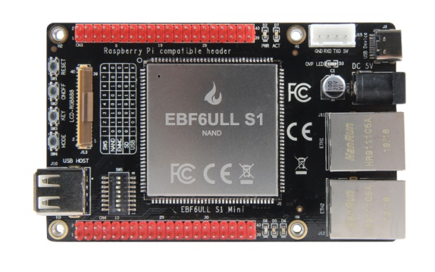
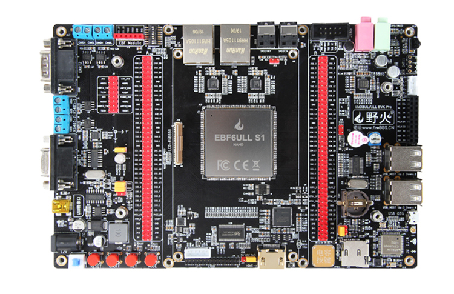
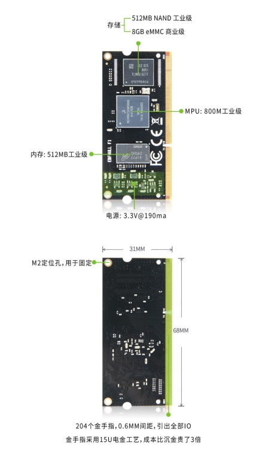
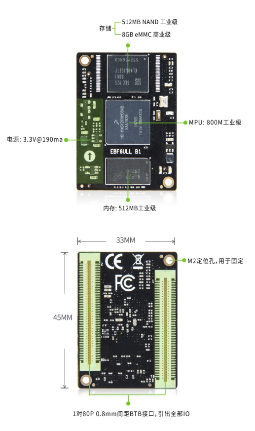
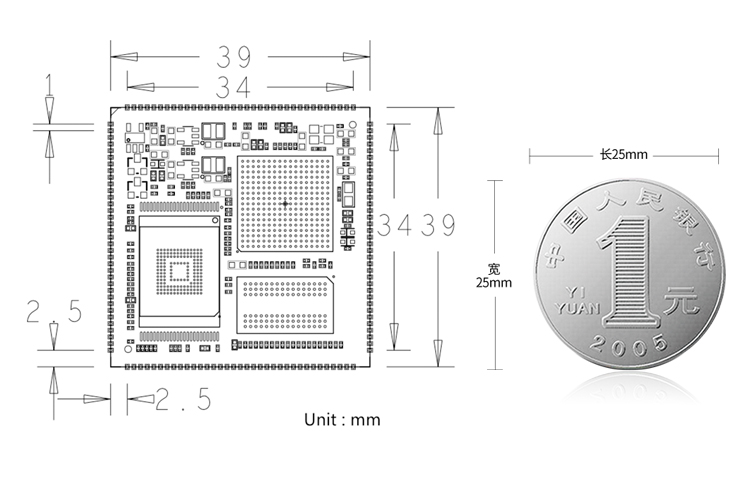

.. vim: syntax=rst

EBF6ULL 核心板硬件数据手册
==========================================

可直接点击页面右上角的“Edit on github”到github下载整个仓库，仓库中包含以下所有硬件资料。

资料下载
------------------------

**邮票孔核心板**：

============  ====================
内容            下载链接
============  ====================
参考设计       :download:`[应用文档]野火i.MX 6ULL 核心板底板电源参考设计.pdf <../../hardware/[应用文档]野火i.MX 6ULL 核心板底板电源参考设计.pdf>`
引脚分配表     :download:`野火_EBF6ULL S1邮票孔核心板_V1.0引脚分配.xlsx <../../hardware/野火_EBF6ULL S1邮票孔核心板_V1.0引脚分配.xlsx>`
硬件原理图     :download:`野火_EBF6ULL S1 邮票孔核心板_V1.0_原理图.pdf <../../hardware/EBF6ULL S1/野火_EBF6ULL S1 邮票孔核心板_V1.0_原理图.pdf>`
机械尺寸图     :download:`野火_EBF6ULL S1 邮票孔核心板_V1.0_机械尺寸.pdf <../../hardware/EBF6ULL S1/野火_EBF6ULL S1 邮票孔核心板_V1.0_机械尺寸.pdf>`
装配图         :download:`野火_EBF6ULL S1 邮票孔核心板_V1.0_装配图.pdf <../../hardware/EBF6ULL S1/野火_EBF6ULL S1 邮票孔核心板_V1.0_装配图.pdf>`
封装库         :download:`野火_EBF6ULL S1 邮票孔核心板_封装库.zip <../../hardware/EBF6ULL S1/封装库.zip>`
============  ====================

**BTB核心板**：

============  ====================
内容            下载链接
============  ====================
硬件原理图     :download:`野火_EBF6ULL B1 核心板_原理图.pdf <../../hardware/EBF6ULL B1/野火_EBF6ULL B1 核心板_原理图.pdf>`
机械尺寸图     :download:`野火_EBF6ULL B1 核心板_机械尺寸.pdf <../../hardware/EBF6ULL B1/野火_EBF6ULL B1 核心板_机械尺寸.pdf>`
装配图         :download:`野火_EBF6ULL B1 核心板_装配图.pdf <../../hardware/EBF6ULL B1/野火_EBF6ULL B1 核心板_装配图.pdf>`
封装库         :download:`野火_EBF6ULL B1 核心板_封装库.zip <../../hardware/EBF6ULL B1/封装库/封装库.zip>`
============  ====================

**金手指核心板**：

============  ====================
内容            下载链接
============  ====================
硬件原理图     :download:`野火_EBF6ULL F1 核心板_原理图.pdf <../../hardware/EBF6ULL F1/野火_EBF6ULL F1 核心板_原理图.pdf>`
机械尺寸图     :download:`野火_EBF6ULL F1 核心板_机械尺寸.pdf <../../hardware/EBF6ULL F1/野火_EBF6ULL F1 核心板_机械尺寸.pdf>`
装配图         :download:`野火_EBF6ULL F1 核心板_装配图.pdf <../../hardware/EBF6ULL F1/野火_EBF6ULL F1 核心板_装配图.pdf>`
封装库         :download:`野火_EBF6ULL F1 核心板_封装库.zip <../../hardware/EBF6ULL F1/封装库/封装库.zip>`
============  ====================

简介
--------------
EBF6ULL 核心板是野火电子基于NXP i.MX6ULL系列处理器设计的一款低功耗、 高性能的嵌入式SOM，
具体实物如下图。根据外观封装分为邮票孔核心板、BTB接口核心板及金手指接口核心板。

MPU主频高达 800MHz（实际为792MHZ），标配512MB内存，存储有512MB NAND和8GB eMMC两种选择。

.. image:: media/imx6s1002.jpeg
   :align: center
   :alt: EBF6ULL S1邮票孔核心板（eMMC和NAND版本）

.. image:: media/imx6s1003.jpeg
   :align: center
   :alt: EBF6ULL S1邮票孔核心板

.. hint::

    eMMC版与NAND版本的区别：

    1. 温度等级：NAND是-40~80°工业级，eMMC是-20~80°商业级；

    #. 容量大小：NAND容量较小，最大可支持到2GB；eMMC容量较大，最大可支持到256GB；

    #. 如何选择：学习可选择eMMC，容量大，可存放大量的应用程序；做产品则按需选择，如果需要工业级，则选择NAND；

    #. 程序兼容：基于NAND和eMMC开发的程序除了U-boot不一样，其它都一样，很容易切换，不存在学习买了eMMC，做产品换成NAND很困难的情况。

核心板PCB采用8层沉金，带阻抗控制，无铅工艺生产，邮票孔间距为1.0mm，整体尺寸仅为39*39mm。

核心板通过FCC和CE验证，批量价只需99RMB，适用于工业控制、手持扫码、喷墨打印机、轨道交通、无人机控制和音频输出等领域。

EBF6ULL S1提供完善的软硬件资料，软件资料有U-boot源码、内核源码、文件系统、编译好的固件和各种QT应用程序；
硬件资料有：核心板封装库，底板应用参考设计原理图。拥有这些资料，客户可大大缩减产品的开发时间，加快产品上市。

EBF6ULL S1邮票孔核心板是为了产品批量使用而开发的，为了方便用户在前期验证这个核心板，我们提供了两款底板，功能由少到多，
覆盖了各个开发群体的用户，如下图。

产品特性
----------------------

===============    =========================================================

MPU                 NXP i.MX6ULL ，Cortex-A7 单核；

频率                800MHZ 工业级（实际为792MHZ）；

内存                256/512MB DDR3；

FALSH               256/512MB NAND和8GB eMMC可选；

电源                3.3V@190MA单电源供电；

PCB                 8层黑色沉金，尺寸为39mm x 39mm；

引脚                140个引脚，引脚间距为1.0mm；

封装                邮票孔封装，单面元件，背面没有元件，底板不需要挖槽。

IO                  全引出，其中GPIO 107个，差分时钟一组，USB专用口2个，POR_B复位脚1个，电源控制口2个；

网口                2路百兆以太网，带PHY

串口                8路

I2C                 4路

CAN                 2路

SPI                 4个

ADC                 10路

PWM                 8路

I2S                 3路

USB OTG             2路

Camera              1路，8位并行摄像头接口

JTAG                1路

LCD                 1路，RGB888，最高支持1366*768分辨率

触摸                1路，电容触摸
===============    =========================================================

注意：以上数据为最大值，可能有复用，请根据EBF6ULL S1核心板引脚说明作为参考设计

命名规则
---------------

EBF6ULL S1邮票孔核心板主控为NXP i.MX6ULL，具体型号为：MIMX6Y2C08AB，
核心板标配内存为512MB DDR3，FLASH 有NAND和eMMC可选，整个核心板的命名方式具体如下表。

.. list-table:: EBF6ULL S1邮票孔核心板命名规则
    :align: center

    * - EBF
      - 野火电子公司英文名EmbedFire

    * - 6ULL
      - NXP i.MX6ULL系列

    * - S
      -  封装形式

         S：表示邮票孔接口

         B：表示BTB接口

         F：表示金手指接口

         H：表示排针接口

    * - 1
      - 第一代V1，需要配合封装来理解

    * - eMMC/NAND
      - FLASH的区别

产品选型
-----------------------

EBF6ULL S1 标配两个版本，一个是eMMC版，一个是NAND版，具体是FLSH的差别，
MPU和使用的内存都是一样的，其中内存和FLASH支持客户定制，大小可裁。

EBF6ULL 系列核心板除了邮票孔封装外，我们还有BTB接口，金手指接口和排针接口可选，
具体可到野火天猫店：https://yehuosm.tmall.com 选购。

邮票孔、BTB、金手指和排针接口的区别仅是接口不一样，硬件配置都一样，包括软件都是兼容的，
这四种接口的核心板的具体区别和推荐使用场合如下表。

.. list-table:: EBF6ULL 系列核心板区别和推荐使用场合
    :align: center
    :header-rows: 1

    * - 版本
      - 尺寸
      - 硬件配置
      - 批量售价
      - 推荐使用场合

    * - 邮票孔
      - 39*39mm
      - 一样
      - 99元
      - 震动大，不拆卸，对成本敏感

    * - 排针
      - 48*38mm
      - 一样
      - 118
      - 震动小，要拆卸，对成本有点敏感

    * - BTB
      - 45*33mm
      - 一样
      - 128元
      - 震动小，要拆卸，对成本不太敏感

    * - 金手指
      - 68*31mm
      - 一样
      - 148元
      - 震动小，要拆卸，土豪

.. image:: media/imx6s1003.jpeg
   :align: center
   :alt: EBF6ULL S1邮票孔核心板

引脚功能
-----------------

EBF6ULL S1邮票孔核心板共140个引脚，单边35个，其中每个引脚的功能请参考：
:download:`野火_EBF6ULL S1邮票孔核心板_V1.0引脚分配.xlsx <../../hardware/EBF6ULL S1/野火_EBF6ULL S1邮票孔核心板_V1.0引脚分配.xlsx>`

硬件参考设计
-------------------

EBF6ULL S1仅仅是一个核心板，是不能单独工作的，需要额外设计底板才能工作，为了方便用户快速的使用这个核心板，
我们提供了EBF6ULL S1 Mini和Pro开发板的原理图以供参考，
具体见：

- :download:`野火_EBF6ULL S1 Mini 底板_V1.0_原理图.pdf <../../hardware/EBF6ULL S1 Mini/野火_EBF6ULL S1 Mini 底板_V1.0_原理图.pdf>`
- :download:`野火_EBF6ULL S1 Pro 底板_V1.0_原理图.pdf <../../hardware/EBF6ULL S1 Pro/野火_EBF6ULL S1 Pro 底板_V1.0_原理图.pdf>`

.. attention::

    要注意是Mini和Pro的原理图为了保持通用性，对于CAN、485和PWM信号接口（包括但不限于这些）是没有隔离的，
    仅能做学习用，如果真正做产品，应对这些电源和信号做隔离处理，特殊问题要特殊处理，切记。

电气参数
--------------

核心板电源
^^^^^^^^^^^^^^

EBF6ULL S1使用单电源方案设计，外部仅需提供3.3V 电源即可正常工作，推荐使用精确并且纹波小的3.3V 电源供电。

EBF6ULL S1电源参数：

======== ====== ====== ====== ==================================
参数     最小值 典型值 最大值 说明
======== ====== ====== ====== ==================================
输入电压 3.3V   3.3V   3.3V   电压范围和纹波应在3.3V 的 2%以内
输入电流 -      190ma  -      电流大小与负载和使用的外设多少有关
======== ====== ====== ====== ==================================

用户的底板上如果有使用多个USB设备，WIFI和大屏幕等设备时，这对整个系统需求的电流就比较大，
在选择电源芯片时候要充分考虑额定电流的输出，要确保核心板和这些外设有足够的电流来确保正常工作。

机械尺寸
---------------

EBF6ULL S1的尺寸为39mm×39mm，如下图，单位mm。

EBF6ULL S1可以作为一个模组嵌入到PCB底板中，
为了减少用户在制作核心板的PCB封装时的尺寸误差，我们提供了核心板的DWG文件，在设计底板PCB时候，
只需将我们提供好的核心板DWG文件导入到底板PCB即可。

- :download:`野火_EBF6ULL S1 邮票孔核心板_V1.0_机械尺寸.pdf <../../hardware/EBF6ULL S1/野火_EBF6ULL S1 邮票孔核心板_V1.0_机械尺寸.pdf>`
- :download:`野火_EBF6ULL S1 邮票孔核心板_封装库.zip <../../hardware/EBF6ULL S1/封装库.zip>`

免责声明
-----------------

开发预备知识
^^^^^^^^^^^^

EBF6ULL S1经过FCC和CE验证，三大件（MPU，内存和FLASH）稳定可靠，但开发人员需知：
这只是一个核心板，其中的GPIO等接口信号是直连MPU的，如果需要使用到粉尘多、震动大、高压等电磁干扰恶劣的环境时，
需要用户在底板上对电源和信号做好隔离等各种保护，而不是出了问题把责难怪罪于核心板，请开发人员具备这个常识。

文档修改权利
^^^^^^^^^^^^

野火电子保留在任何时候不事先声明的情况下， 对EBF6ULL S1系列邮票孔核心板相关文档修改的权利。

EMI和EMC
^^^^^^^^^^^^

EBF6ULL S1邮票孔核心板机械结构决定了其 EMI 性能必然与一体化电路设计有所差异，用户如有特殊要求，必须事先与野火电子沟通。

EBF6ULL S1邮票孔核心板EMC 性能与底板的设计密切相关，尤其是电源电路、 I/O 隔离、复位电路，
用户在设计底板时必须充分考虑以上因素。野火电子将努力完善EBF6ULL S1邮票孔核心板的电磁兼容特性，但不对用户最终应用产品 EMC 性能提供任何保证。

ESD静电放电保护
^^^^^^^^^^^^^^^^^^^^^^^^

将EBF6ULL S1邮票孔核心板用电烙铁自行焊接在自己的底板上或者批量装配时，请先将积累在身体上的静电释放，例如佩戴可靠接地的静电环。

